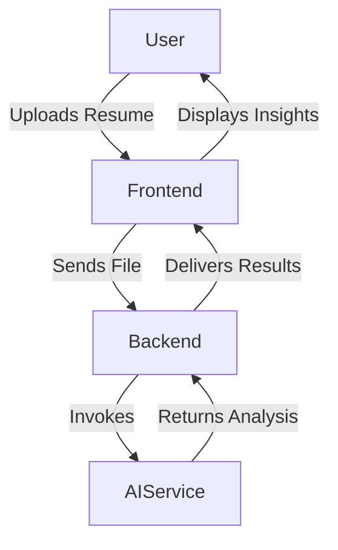
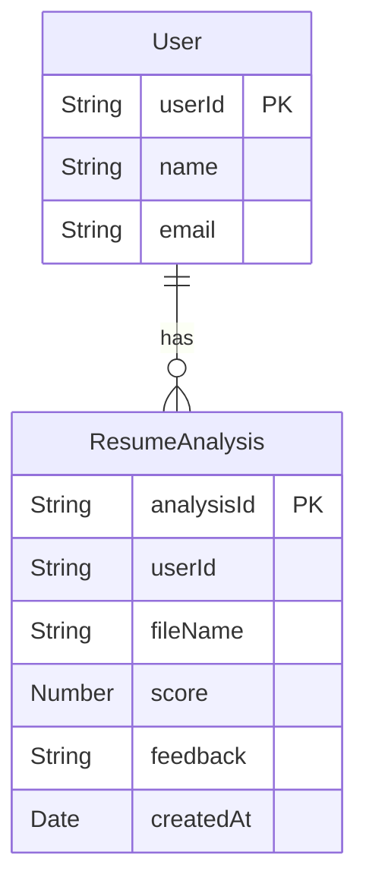

# AI Resume Analyzer

AI Resume Analyzer is a web application that leverages artificial intelligence to evaluate and provide feedback on resumes. It streamlines the resume screening process by automatically analyzing uploaded documents, extracting key information, and offering actionable insights for both job seekers and recruiters.

---

## Table of Contents

- [Introduction](#introduction)
- [Features](#features)
- [System Architecture](#system-architecture)
- [Installation](#installation)
- [Configuration](#configuration)
- [Usage](#usage)
- [API Documentation](#api-documentation)
- [Data Model](#data-model)
- [Project Structure](#project-structure)
- [Testing](#testing)
- [Contributing](#contributing)
- [License](#license)
- [Acknowledgements](#acknowledgements)

---

## Introduction

AI Resume Analyzer automates resume parsing and feedback using advanced AI models. The app accepts various file formats, processes data, and delivers valuable metrics and suggestions. Users benefit from efficient resume assessments, while HR professionals save time in candidate screening.

---

## Features

- Analyze resumes using AI and NLP.
- Extract and standardize candidate information.
- Provide resume scoring and improvement suggestions.
- Support for multiple file formats (PDF, DOCX).
- REST API for integration with other platforms.
- Modern UI for easy upload and results visualization.

---

## System Architecture

The application consists of a web frontend, a backend API, and an AI analysis engine. The backend handles file uploads, communicates with the AI service, and returns results to the frontend.



---

## Installation

Follow these steps to set up the project locally:

1. Clone the repository:
    ```bash
    git clone https://github.com/veenit9560/ai-resume-analyzer.git
    cd ai-resume-analyzer
    ```
2. Install dependencies:
    ```bash
    npm install
    ```
3. Set up environment variables by copying `.env.example` to `.env` and updating values.
4. Start the development server:
    ```bash
    npm start
    ```

---

## Configuration

The application uses environment variables to configure database connections, AI API keys, and server settings. Edit the `.env` file to match your environment.

Typical configuration options:

- `PORT`: Server port.
- `DATABASE_URL`: Database connection string.
- `AI_API_KEY`: API key for the AI analysis service.
- `UPLOAD_DIR`: Directory for storing uploaded files.

---

## Usage

- Access the UI at `http://localhost:<PORT>`.
- Upload a resume in PDF or DOCX format.
- Wait for processing; results will display on the dashboard.
- Review feedback and download the analysis report if desired.

---

## API Documentation

### Upload Resume (POST /api/resume/upload)

#### Upload Resume Endpoint (POST)

#### POST /api/resume/upload

```api
{
    "title": "Upload Resume",
    "description": "Upload a resume file for analysis.",
    "method": "POST",
    "baseUrl": "http://localhost:3000",
    "endpoint": "/api/resume/upload",
    "headers": [
        {
            "key": "Content-Type",
            "value": "multipart/form-data",
            "required": true
        }
    ],
    "queryParams": [],
    "pathParams": [],
    "bodyType": "form",
    "formData": [
        {
            "key": "file",
            "value": "Resume file (PDF, DOCX)",
            "required": true
        }
    ],
    "responses": {
        "200": {
            "description": "Resume processed successfully.",
            "body": "{\n  \"success\": true,\n  \"analysisId\": \"12345\"\n}"
        },
        "400": {
            "description": "Invalid file format or missing file.",
            "body": "{\n  \"error\": \"Invalid file format.\"\n}"
        }
    }
}
```

### Get Analysis Result (GET /api/resume/analysis/:id)

#### Analysis Result Endpoint (GET)

```api
{
    "title": "Get Resume Analysis",
    "description": "Retrieve the analysis results for a submitted resume.",
    "method": "GET",
    "baseUrl": "http://localhost:3000",
    "endpoint": "/api/resume/analysis/:id",
    "headers": [],
    "queryParams": [],
    "pathParams": [
        {
            "key": "id",
            "value": "Analysis ID",
            "required": true
        }
    ],
    "bodyType": "none",
    "requestBody": "",
    "responses": {
        "200": {
            "description": "Resume analysis data retrieved successfully.",
            "body": "{\n  \"analysisId\": \"12345\",\n  \"score\": 85,\n  \"feedback\": \"Your resume is strong but could highlight skills more.\"\n}"
        },
        "404": {
            "description": "Analysis not found.",
            "body": "{\n  \"error\": \"Analysis not found.\"\n}"
        }
    }
}
```

---

## Data Model

The backend stores resume analysis results using a simple schema.



---

## Project Structure

- `frontend/` – React app for the user interface.
- `backend/` – Node.js/Express server handling API and file uploads.
- `ai/` – AI and NLP scripts or integrations.
- `models/` – Database models and ORM definitions.
- `public/` – Static assets.
- `tests/` – Unit and integration tests.
- `.env.example` – Sample environment variables.

---

## Testing

Run automated tests to ensure code quality:

```bash
npm test
```

Tests cover API endpoints, file handling, and core analysis logic.

---

## Contributing

Contributions are welcome! To get started:

- Fork the repository and create a new branch.
- Make your changes and write tests.
- Submit a pull request describing your work.

---

## License

This project uses the MIT License. See the `LICENSE` file for details.

---

## Acknowledgements

- OpenAI for language and NLP models.
- Contributors and the open-source community.
- Users for feedback and support.

---

```card
{
    "title": "Quick Start Tip",
    "content": "Clone the repo, install dependencies, and start the server to analyze your first resume."
}
```
